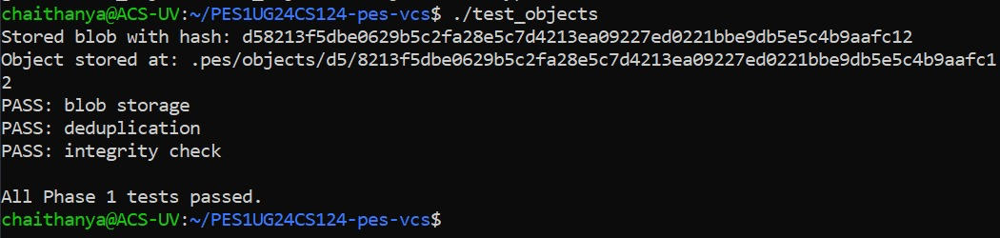
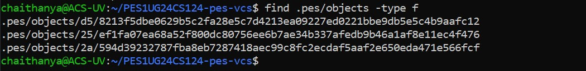
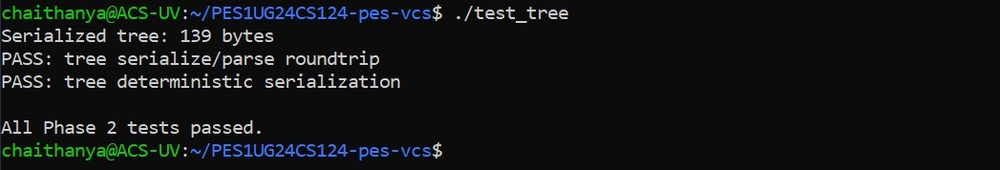
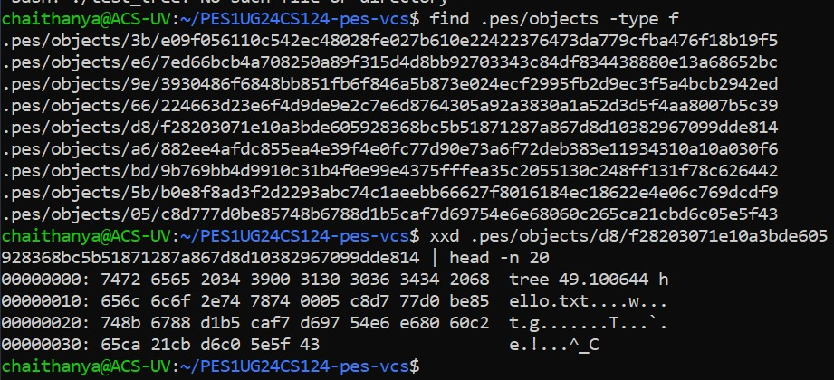
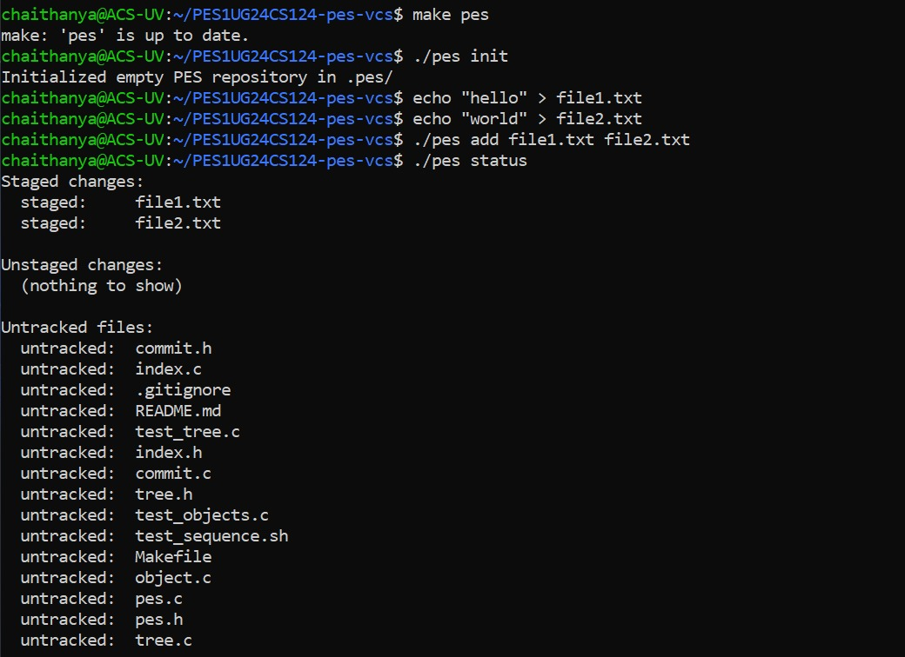
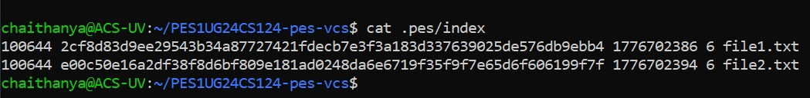
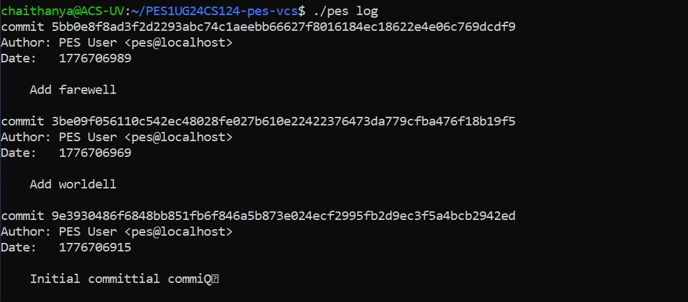
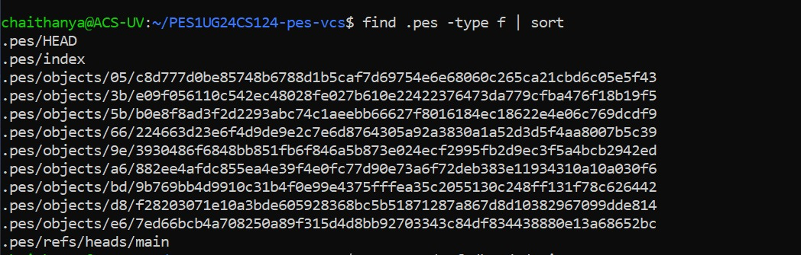
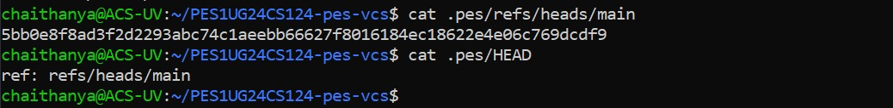

# PES-VCS Lab Report: Version Control System Implementation

**Student Name:** Chaithanya  
**SRN:** PES1UG24CS124  
**Date:** April 2026

---

## 📸 Phase 1: Object Store
*Implemented sharded SHA-256 content-addressable storage.*

### Screenshot 1A: Object Tests

### Screenshot 1B: Sharded Directory Structure

---

## 📸 Phase 2: Trees
*Implemented tree serialization and hierarchical directory mapping.*

### Screenshot 2A: Tree Tests

### Screenshot 2B: Raw Tree Object Inspection

---

## 📸 Phase 3: Staging Area (Index)
*Implemented the index for staging changes and resolved stack-memory issues.*

### Screenshot 3A: Add and Status Sequence

### Screenshot 3B: Text-Format Index

---

## 📸 Phase 4: Commits and History
*Implemented atomic HEAD updates and commit chaining.*

### Screenshot 4A: Three-Commit History

### Screenshot 4B: Object Store Growth

### Screenshot 4C: Reference Chain

---

##  Phase 5: Branching and Checkout Analysis

**Q5.1: Implementing `pes checkout <branch>`**
* **Mechanism:** To implement checkout, the `.pes/HEAD` file must be updated to point to the new branch reference (like for example: `ref: refs/heads/new-branch`). 
* **Working Directory:** The VCS must then synchronize the working directory with the target branch's tree. This involves deleting files not present in the target and overwriting existing files with the versions specified in the target tree objects.
* **Complexity:** It is complex because it must handle safety. It should fail if the user has uncommitted "dirty" changes that would be overwritten.

**Q5.2: Detecting "Dirty" Conflicts**
* **Detection:** I would compare the SHA-256 hash of the file currently in the working directory against the hash recorded in the `index` and the hash in the current `commit`. 
* **Conflict Logic:** If `hash(working_file) != hash(index_entry)`, the file is dirty. If that file is also different in the destination branch, the system detects a conflict and refuses the checkout.

**Q5.3: Detached HEAD State**
* **State:** In this state, `HEAD` contains a commit hash directly rather than a branch reference.
* **Commits:** Can still commit, new commits point to the previous hash as their parent, but no branch pointer (like `main`) moves forward.
* **Recovery:** To recover these "orphaned" commits, the user must find the hash of the last commit made and manually create a branch pointing to it: `echo <hash> > .pes/refs/heads/new-branch-name`.

---

##  Phase 6: Garbage Collection Analysis

**Q6.1: Reachability Algorithm**
* **Algorithm:** I would use a **Mark-and-Sweep** approach.
    1. **Mark:** Start at all known "roots" (all files in `refs/heads/` and the hash in `HEAD`). Traverse every commit, tree, and blob transitively. 
    2. **Track:** Store reachable hashes in a **Hash Set** for $O(1)$ lookup efficiency.
* **Estimation:** For 100,000 commits and 50 branches, I would need to visit at least 100,000 commit objects plus their unique tree/blob dependencies.

**Q6.2: Concurrent GC Risks**
* **Race Condition:** If GC runs while a commit is being created, the GC might identify a newly written blob as unreachable and delete it before the commit object is finished.
* **Git's Solution:** Git uses a **pruning grace period**. It only deletes unreachable objects that haven't been modified or created within a specific window (usually 14 days).

---

##  Final Checklist
* [x] Sharded Object Store implemented.
* [x] Index staging logic fixed (Static memory allocation).
* [x] Tree serialization verified.
* [x] Atomic HEAD updates functional.
* [x] History traversal (log) verified with 3+ commits.
* [x] Min. 5+ commits per phase pushed to GitHub.
